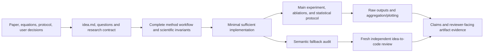

# Faithful Research Code

[English](README.md) | [简体中文](README.zh-CN.md)

A Codex Skill for research-code generation, paper reproduction, experimental implementation, ablation studies, and reviewer-facing artifact releases.

It treats research code as an executable scientific claim. Code must do more than run: every implementation choice, experiment command, raw artifact, and reported conclusion should be traceable to a paper, equation, protocol, reference implementation, or explicit user decision. Unauthorized silent semantic fallbacks are forbidden.

## Why This Skill Exists

Codex is a general-purpose coding agent whose default behavior is often closer to that of a software engineer than a researcher. When inputs are missing, execution fails, or environments differ, it may favor availability and continued execution by adding defaults, compatibility branches, retries, fallback backends, data filtering, or graceful degradation.

That engineering mindset is useful in production systems, but it can be scientifically invalid. The primary goal of research code is not to “keep running”; it is to **execute the declared method faithfully**. A seemingly reasonable fallback can alter the study population, data distribution, algorithmic path, training state, evaluation protocol, or statistical denominator. The program may still finish successfully while no longer representing the method described in the paper.

`faithful-research-code` shifts Codex from “engineering availability first” to “method fidelity and evidence traceability first” for research tasks:

- expose unknowns instead of silently resolving them;
- require authorization for semantic changes;
- show the complete technical workflow and artifact flow;
- implement only the minimum functionality required by the research method;
- preserve genuine security controls for authentication, permissions, paths, resources, and destructive actions.

## Background

General-purpose code generators often optimize for production reliability, compatibility, and uninterrupted execution. They may automatically:

- switch to a substitute implementation when a dependency is missing;
- skip samples after parsing errors;
- reduce batch size or change precision after an out-of-memory failure;
- clip, impute, or filter exceptional values;
- load incompatible checkpoints with relaxed matching;
- exclude failed runs from the statistical denominator;
- replace an unavailable official evaluator with a proxy metric.

These mechanisms may be reasonable in engineering systems, but in research code they can change the data distribution, algorithmic path, training state, evaluation protocol, or scientific conclusion.

## Goals

`faithful-research-code` requires Codex to:

1. generate minimal and direct research code that follows the declared sources;
2. expose conflicts among papers, supplements, reference code, protocols, and user requirements;
3. use a zero semantic-change budget by default;
4. document the complete technical workflow, module principles, inputs, outputs, and artifact handoffs;
5. separate main experiments, ablations, adaptations, and exact reproductions;
6. trace paper claims to commands, frozen configurations, raw results, aggregation, and figures;
7. retain real security boundaries such as authentication, authorization, resource limits, and destructive-action confirmation.

## Supported Research Modes

- `EXACT_REPRODUCTION`: reproduce results from a specified source;
- `SPEC_IMPLEMENTATION`: implement a given equation, algorithm, or experimental protocol;
- `ADAPTATION`: make explicitly authorized changes while preserving declared components;
- `ABLATION`: change exactly one declared scientific factor;
- `AUDIT`: inspect existing code for deviations from the research method.

Ordinary web development, production-service refactoring, authentication security, and documentation-only edits should not trigger this Skill.

## Dashboard Example

This screenshot comes from the bundled HTML viewer using **simulated events and Token counts**. No external model was called. It shows the interface, not research results.


- **Top panel:** active stages, reported versus estimated input/output Tokens, and per-request status. Missing usage remains unknown.
- **Workflow:** loading is complete; the main and ablation branches are both running; the evaluation stage waits for both. Nodes show requirement IDs from the project's `idea.md` and offer expandable descriptions in the live viewer.
- **Updates:** the local HTML viewer updates at stage transitions or explicit batch/round boundaries; failures and observation changes also trigger updates. The image in this README is a static preview. Follow [Compact Output and Live Workflow](#compact-output-and-live-workflow) to open the local viewer for your own project.

## Core Workflow

The existing HTML viewer combines workflow progress with reported/estimated Token usage and request details. Research programs must explicitly record actual call observations; missing or uninstrumented usage is unknown, and Codex conversation usage is not inferred. See the [usage integration contract](faithful-research-code/references/usage-dashboard.md).

Implementation starts with project-root `idea.md`: the research question, concrete datasets/splits, ordered algorithm steps, main/baseline/ablation experiments, and acceptance conditions. The agent actively asks about consequential ambiguity and pauses dependent work; it does not invent defaults or silently exclude requirements. Each requirement maps to workflow nodes, code, and checks. Scientific changes preserve their authorization and earlier run specifications. See the [idea template](faithful-research-code/assets/research-idea-template.md) and [review protocol](faithful-research-code/references/idea-and-review.md).

The graph below is an overview. Actual project graphs name the real data and algorithm steps. The local live viewer shows requirement IDs and expandable descriptions, with concurrent branches and dependency joins. Colors report execution state, not scientific fidelity. Before handoff, a fresh independent agent reads the specification, original sources/decisions, and code to check drift, missing behavior, and unnecessary functionality; fixes receive a recheck. If that capability is unavailable, the review gap is explicitly reported.



### 1. Research Contract

Every consequential choice is classified as:

- `METHOD_DEFINED`: explicitly defined by the method or source;
- `PROTOCOL_DEFINED`: defined by the dataset, benchmark, or evaluator;
- `USER_DEFINED`: explicitly authorized by the user;
- `UNKNOWN`: unresolved by the available evidence.

An `UNKNOWN` requires an active clarification question and blocks dependent implementation. Parameterization or exclusion requires an explicit developer decision.

### 2. Complete Code Workflow

For every stage or round, the Skill requires documentation of:

- invocation and execution conditions;
- inputs and their provenance;
- technical principle and governing source rule;
- implementation location;
- output artifacts;
- downstream use;
- failure behavior;
- actual validation method.

For prompts, retrieval, positive and negative examples, memory, training records, rewards, and evaluators, it also records selection rules, insertion locations, parsing, and causal use.

### 3. Claim-to-Result Traceability

Every central claim, result table, and figure should map to:

```text
paper claim
  -> exact command
  -> frozen configuration
  -> data/model/evaluator versions and hashes
  -> seeds and run records
  -> raw outputs
  -> aggregation or plotting code
  -> expected result and tolerance
  -> actual execution status
```

Reported values must not be manually copied into tables or figures.

### 4. Tuning, Statistics, and Baseline Fairness

For result-producing experiments, declare in advance:

- hyperparameter search space, method, and budget;
- validation/test access boundaries;
- checkpoint, threshold, and best-configuration selection rules;
- experimental unit, seeds, run count, and estimator;
- uncertainty, failed runs, and statistical denominator;
- differences in data, tuning budgets, compute, selection rules, and evaluators across baselines.

### 5. Reviewer-Ready Artifacts

For paper releases, public repositories, and artifact evaluation, the Skill also requires:

- frozen code and environment versions;
- separate smoke-test and full-reproduction commands;
- an executable command for every major claim;
- data/model provenance, licenses, and access restrictions;
- time, GPU/CPU, memory, storage, network, and external-service costs;
- release status for anonymous review and archival versions;
- known limitations and applicable ethics, privacy, or AI-use disclosures.

These release requirements are not imposed on an isolated equation or a small deterministic implementation.

## Install

### 0. Install Codex

Use a Codex surface that supports local Skills. For Codex CLI, install the current package with npm:

```bash
npm install -g @openai/codex
codex
```

Sign in when prompted. See the [official Codex quickstart](https://developers.openai.com/codex/quickstart/) for the desktop app, CLI, and IDE options.

### 1. Ask Codex to Install the Skill (Recommended)

Start a Codex task and send:

```text
Install the faithful-research-code skill from
https://github.com/Fangzhou-Code/faithful-research-code/tree/main/faithful-research-code
```

Codex should install the repository subdirectory into `~/.codex/skills/faithful-research-code`. The Skill becomes available on the next turn.

### 2. Use the Built-In Skill Installer

```bash
python3 ~/.codex/skills/.system/skill-installer/scripts/install-skill-from-github.py \
  --repo Fangzhou-Code/faithful-research-code \
  --path faithful-research-code
```

The installer downloads public repositories directly and falls back to Git sparse checkout when needed. It stops if `~/.codex/skills/faithful-research-code` already exists; back up or move the existing directory before reinstalling.

### 3. Install Manually with Git

```bash
git clone https://github.com/Fangzhou-Code/faithful-research-code.git
cp -R faithful-research-code/faithful-research-code ~/.codex/skills/
```

Start a new Codex turn and invoke the Skill explicitly:

```text
$faithful-research-code Implement the main experiment from the paper and supplement.
Do not introduce unauthorized semantic fallbacks.
```

## Usage Examples

### Paper Reproduction

```text
Use $faithful-research-code to reproduce the paper's main experiment, map every
reported result to its command and raw artifacts, and expose unresolved source
conflicts.
```

### Ablation Study

```text
Use $faithful-research-code to remove only the auxiliary loss, keep every other
scientific factor fixed, and document main and ablation experiments separately.
```

### Code Audit

```text
Use $faithful-research-code to audit this training pipeline for sample dropping,
clipping, checkpoint fallback, backend switching, and denominator changes.
Do not edit unless requested.
```

## Generated Research README Requirements

For implementation tasks, the Skill generates or updates the research project's own `README.md` with:

- background;
- gap and challenges;
- methodological contributions;
- supported scope and limitations;
- main experiments;
- ablation experiments;
- concise explanations of each parameter and its scientific effect;
- complete code workflow and technical principles;
- paper-result reproduction mapping;
- tuning and statistical protocol;
- artifact release and verification status.

All content must come from the actual code and available sources. Commands, results, contributions, licenses, and ethics approvals must never be invented.

## Python Semantic Fallback Auditor

Operational failures are strictly fail-fast: disable implicit SDK/HTTP retries, stop without substitution or sample skipping, and preserve failed-run evidence. Only steps predeclared in the scientific method remain valid; logging, tests, and suppression comments do not authorize recovery. Default to serial execution and verify ordering, random streams, and failure propagation for protocol-defined concurrency.

Rules cover implicit SDK retries (RF504), retry configuration (RF505), concurrency (RF601), exceptions returned as values (RF602), quantile methods (RF701), and thread initialization order (RF702). Retry rule RF501 is high severity. Import aliases and local bindings are tracked by scope, so function-local imports and parameters do not overwrite outer bindings. Function-body imports are not treated as already executed module imports; unresolved execution order requires review. This is not cross-module data-flow analysis. Missing inputs and empty scans return an error.

For NumPy quantile and percentile functions, RF701 recognizes `method=` or the sixth positional argument; the fifth argument is `overwrite_input`. Dynamic argument unpacking requires review rather than being assumed to specify the estimator.

The repository includes a supplementary Python auditor:

```bash
python faithful-research-code/scripts/audit_semantic_fallbacks.py \
  path/to/changed_code \
  --min-severity low --fail-on medium
```

Generate a JSON audit trail:

```bash
python faithful-research-code/scripts/audit_semantic_fallbacks.py \
  path/to/changed_code \
  --json
```

Source-authorized operations may use a reasoned suppression marker:

```python
# research-fidelity: allow=RF301 reason="Equation 4 requires clipping before reduction"
value = value.clip(-1, 1)
```

Suppressed findings remain in the JSON audit trail. This is a Python AST heuristic, not a proof of research fidelity. YAML, Shell, Slurm, notebooks, aggregation, and plotting paths still require manual review.

## Compact Output and Live Workflow

The Skill incorporates compatible minimality ideas from [Ponytail](https://github.com/DietrichGebert/ponytail/blob/main/skills/ponytail/SKILL.md) without requiring another plugin or persistent hooks. Scientific fidelity and evidence take priority over line counts. Write code and complete evidence to files; keep chat to the workflow, changes, validation, and links. No unmeasured token-saving percentage is promised.

Show complete generation and scientific execution dependency graphs separately before coding. Independent nodes appear side by side and can run simultaneously; joins wait for all required dependencies. States include pending, running, succeeded, failed, blocked, confirmed cancellation, conditional skip, and unknown. Failure rejects new starts but retains truthful in-flight outcomes. A stopped track cannot commit reportable scientific results. Completed generation never implies an executed experiment.

Requires Python 3.11+. Adapt the [example plan](faithful-research-code/assets/progress-plan.example.json) to the actual project, then run:

```bash
python faithful-research-code/scripts/research_progress.py init runs/progress-001 --plan project-plan.json
python faithful-research-code/scripts/research_progress.py serve runs/progress-001
```

Open the printed local URL. Use `event` at actual generation boundaries and `stage()` around actual scientific work. See [progress and output](faithful-research-code/references/progress-and-output.md) for integration and limitations. The scientific pipeline retains tracebacks and partial artifacts; the progress journal records only exception types. Chat Mermaid diagrams are snapshots. A hard kill can leave a last-known running state; the viewer never infers success.

The HTML page checks a lightweight status endpoint once per second. The graph and Token panel update at stage transitions or explicit batch/round progress events; request failures and changes in supervisor observation also trigger an update. Concurrent branches retain their own states. Successful per-request usage is still logged immediately and becomes visible at the next display boundary; a newly opened page shows the latest recorded state.

The persistent writer and viewer process newly appended events after initial reconstruction, using a request-ID index and incremental usage totals. They do not replay the entire history on every write or poll. Complete logs remain available for audit and independent reconstruction. An uncertain journal write retains the writer lock to prevent continuation across cache eviction or process restart; no automatic resend or log repair occurs.

Concurrent workers must use the serial collector started with `collect --endpoint <private-endpoint.json>` through `event --collector` or `stage(..., collector=...)`. The collector serializes journal writes, not science; it never retries events or cancels scientific processes. Predeclare conditional nodes with `condition`, and joins accepting skipped inputs with `optional_dependencies`. Use a frozen `total` and `update --completed N` for real work counts.

The auditor requires Python 3.11+ and accepts `--config resolved.json resolved.toml` to inspect configured retry/concurrency policies. Its JSON report explicitly lists unverified runtime/dynamic surfaces. Export YAML or executable configuration from the actual launcher rather than treating a static scan as complete verification.

## Repository Structure

```text
.
├── README.md
├── README.zh-CN.md
├── VALIDATION.zh-CN.md
└── faithful-research-code/
    ├── SKILL.md
    ├── agents/openai.yaml
    ├── assets/research-idea-template.md
    ├── assets/research-readme-template.md
    ├── assets/progress-plan.example.json
    ├── assets/execution-plan.example.json
    ├── assets/dashboard-example.jpg
    ├── assets/behavior-eval/
    ├── references/code-generation-contract.md
    ├── references/idea-and-review.md
    ├── references/progress-and-output.md
    ├── references/usage-dashboard.md
    ├── references/runtime-verification.md
    ├── scripts/audit_semantic_fallbacks.py
    ├── scripts/research_progress.py
    ├── scripts/run_research_workflow.py
    ├── scripts/evaluate_behavior.py
    └── tests/
```

The repository-level README files and optional validation record are not part of the installed Skill package.

## Validation

See [runtime verification](faithful-research-code/references/runtime-verification.md) for the minimal evidence gate: dynamic behavior needs executed checks; missing checks block the corresponding verification claim rather than becoming a clean static-audit result.

- `scripts/run_research_workflow.py` optionally supervises an explicit local command DAG, including direct-child failure, timeout, cancellation, heartbeat, retained logs, and a completion manifest. Reuse an existing suitable scheduler instead of adding a second one.
- `scripts/evaluate_behavior.py` runs the same scientific behavior checks against separately generated candidates, retaining PASS/FAIL/TIMEOUT, code hashes, and logs. PASS requires all eight checks' completion evidence as well as exit code zero, including a correct published result; early exit and skipped checks fail. The frozen prompt/reference under `assets/behavior-eval/` tests the harness and supports repeatable comparisons; a reference rerun is not new cross-model evidence.

The evaluator saves candidate and test source snapshots before execution. It verifies the candidate snapshot hash and executes those source bytes directly with `compile`/`exec`, bypassing stale candidate bytecode. Reported hashes identify the saved snapshots even if the original source changes during evaluation. Imported helper modules and dependencies still require separate version pinning.

Executable local demonstration, with no scientific reproduction claim:

```bash
python faithful-research-code/scripts/run_research_workflow.py faithful-research-code/assets/execution-plan.example.json runs/local-example
python faithful-research-code/scripts/research_progress.py serve runs/local-example
```

The runner requires explicit `direct_children_only` scope. Nested multiprocessing, remote jobs, and detached daemons need their own appropriate supervisor. A failed run has no `RUN_COMPLETE.json` and its partial artifacts must not enter formal aggregation. A completion manifest establishes command execution, not scientific correctness.

Run the unit tests:

```bash
python3 -m unittest discover \
  -s faithful-research-code/tests \
  -p 'test_*.py'
```

The latest local validation on 2026-09-20 passed **81 repository tests**. Coverage includes contract routing, trigger-fixture integrity, scoped aliases and parameter shadowing, quantile arguments, retry/concurrency rules, stale-bytecode regressions, source-hash consistency, progress transitions, and failure evidence. Incremental monitoring tests compare totals with complete reconstruction for 10,000 simulated requests and check partial records, replaced/truncated logs, and uncertain writes. Browser checks verified that per-request logging does not redraw the panel until a stage/progress boundary. Details are recorded in [VALIDATION.zh-CN.md](VALIDATION.zh-CN.md).

Trigger-fixture checks do not measure actual model activation accuracy or research-generation behavior; simulated usage and local tests do not establish live-service or paper-reproduction results.

## Limitations

- The auditor covers Python AST and explicitly supplied JSON/TOML, but cannot prove dynamic cross-module behavior or real outbound request counts;
- the Skill cannot replace author confirmation for an unspecified protocol;
- passing tests does not establish numerical reproduction of a paper;
- an author-run result cannot be described as an independent third-party reproduction;
- current venue policies govern anonymity, ethics, and artifact requirements.

## License

This repository does not currently include a license file. Default copyright rules apply until a license is selected.
