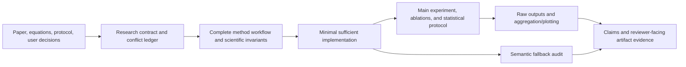

# Faithful Research Code

[English](README.md) | [简体中文](README.zh-CN.md)

A Codex Skill for research-code generation, paper reproduction, experimental implementation, ablation studies, and reviewer-facing artifact releases.

It treats research code as an executable scientific claim. Code must do more than run: every implementation choice, experiment command, raw artifact, and reported conclusion should be traceable to a paper, equation, protocol, reference implementation, or explicit user decision. Unauthorized silent semantic fallbacks are forbidden.

## Why This Skill Exists

Codex is a general-purpose coding agent whose default behavior is often closer to that of a software engineer than a researcher. When inputs are missing, execution fails, or environments differ, it may favor availability and continued execution by adding defaults, compatibility branches, retries, fallback backends, data filtering, or graceful degradation.

That engineering mindset is useful in production systems, but it can be scientifically invalid. The primary goal of research code is not to “keep running”; it is to **execute the declared method faithfully**. A seemingly reasonable fallback can alter the study population, data distribution, algorithmic path, training state, evaluation protocol, or statistical denominator. The program may still finish successfully while no longer representing the method described in the paper.

`faithful-research-code` shifts Codex from “engineering availability first” to “method fidelity and evidence traceability first” for research tasks:

- expose unknowns instead of silently resolving them;
- require authorization for semantic changes;
- show the complete technical workflow and artifact flow;
- implement only the minimum functionality required by the research method;
- preserve genuine security controls for authentication, permissions, paths, resources, and destructive actions.

## Background

General-purpose code generators often optimize for production reliability, compatibility, and uninterrupted execution. They may automatically:

- switch to a substitute implementation when a dependency is missing;
- skip samples after parsing errors;
- reduce batch size or change precision after an out-of-memory failure;
- clip, impute, or filter exceptional values;
- load incompatible checkpoints with relaxed matching;
- exclude failed runs from the statistical denominator;
- replace an unavailable official evaluator with a proxy metric.

These mechanisms may be reasonable in engineering systems, but in research code they can change the data distribution, algorithmic path, training state, evaluation protocol, or scientific conclusion.

## Goals

`faithful-research-code` requires Codex to:

1. generate minimal and direct research code that follows the declared sources;
2. expose conflicts among papers, supplements, reference code, protocols, and user requirements;
3. use a zero semantic-change budget by default;
4. document the complete technical workflow, module principles, inputs, outputs, and artifact handoffs;
5. separate main experiments, ablations, adaptations, and exact reproductions;
6. trace paper claims to commands, frozen configurations, raw results, aggregation, and figures;
7. retain real security boundaries such as authentication, authorization, resource limits, and destructive-action confirmation.

## Supported Research Modes

- `EXACT_REPRODUCTION`: reproduce results from a specified source;
- `SPEC_IMPLEMENTATION`: implement a given equation, algorithm, or experimental protocol;
- `ADAPTATION`: make explicitly authorized changes while preserving declared components;
- `ABLATION`: change exactly one declared scientific factor;
- `AUDIT`: inspect existing code for deviations from the research method.

Ordinary web development, production-service refactoring, authentication security, and documentation-only edits should not trigger this Skill.

## Core Workflow



### 1. Research Contract

Every consequential choice is classified as:

- `METHOD_DEFINED`: explicitly defined by the method or source;
- `PROTOCOL_DEFINED`: defined by the dataset, benchmark, or evaluator;
- `USER_DEFINED`: explicitly authorized by the user;
- `UNKNOWN`: unresolved by the available evidence.

An `UNKNOWN` is never silently implemented. It must block execution, remain parameterized, receive explicit authorization, or be excluded from the conclusion.

### 2. Complete Code Workflow

For every stage or round, the Skill requires documentation of:

- invocation and execution conditions;
- inputs and their provenance;
- technical principle and governing source rule;
- implementation location;
- output artifacts;
- downstream use;
- failure behavior;
- actual validation method.

For prompts, retrieval, positive and negative examples, memory, training records, rewards, and evaluators, it also records selection rules, insertion locations, parsing, and causal use.

### 3. Claim-to-Result Traceability

Every central claim, result table, and figure should map to:

```text
paper claim
  -> exact command
  -> frozen configuration
  -> data/model/evaluator versions and hashes
  -> seeds and run records
  -> raw outputs
  -> aggregation or plotting code
  -> expected result and tolerance
  -> actual execution status
```

Reported values must not be manually copied into tables or figures.

### 4. Tuning, Statistics, and Baseline Fairness

For result-producing experiments, declare in advance:

- hyperparameter search space, method, and budget;
- validation/test access boundaries;
- checkpoint, threshold, and best-configuration selection rules;
- experimental unit, seeds, run count, and estimator;
- uncertainty, failed runs, and statistical denominator;
- differences in data, tuning budgets, compute, selection rules, and evaluators across baselines.

### 5. Reviewer-Ready Artifacts

For paper releases, public repositories, and artifact evaluation, the Skill also requires:

- frozen code and environment versions;
- separate smoke-test and full-reproduction commands;
- an executable command for every major claim;
- data/model provenance, licenses, and access restrictions;
- time, GPU/CPU, memory, storage, network, and external-service costs;
- release status for anonymous review and archival versions;
- known limitations and applicable ethics, privacy, or AI-use disclosures.

These release requirements are not imposed on an isolated equation or a small deterministic implementation.

## Install

### 0. Install Codex

Use a Codex surface that supports local Skills. For Codex CLI, install the current package with npm:

```bash
npm install -g @openai/codex
codex
```

Sign in when prompted. See the [official Codex quickstart](https://developers.openai.com/codex/quickstart/) for the desktop app, CLI, and IDE options.

### 1. Ask Codex to Install the Skill (Recommended)

Start a Codex task and send:

```text
Install the faithful-research-code skill from
https://github.com/Fangzhou-Code/faithful-research-code/tree/main/faithful-research-code
```

Codex should install the repository subdirectory into `~/.codex/skills/faithful-research-code`. The Skill becomes available on the next turn.

### 2. Use the Built-In Skill Installer

```bash
python3 ~/.codex/skills/.system/skill-installer/scripts/install-skill-from-github.py \
  --repo Fangzhou-Code/faithful-research-code \
  --path faithful-research-code
```

The installer downloads public repositories directly and falls back to Git sparse checkout when needed. It stops if `~/.codex/skills/faithful-research-code` already exists; back up or move the existing directory before reinstalling.

### 3. Install Manually with Git

```bash
git clone https://github.com/Fangzhou-Code/faithful-research-code.git
cp -R faithful-research-code/faithful-research-code ~/.codex/skills/
```

Start a new Codex turn and invoke the Skill explicitly:

```text
$faithful-research-code Implement the main experiment from the paper and supplement.
Do not introduce unauthorized semantic fallbacks.
```

## Usage Examples

### Paper Reproduction

```text
Use $faithful-research-code to reproduce the paper's main experiment, map every
reported result to its command and raw artifacts, and expose unresolved source
conflicts.
```

### Ablation Study

```text
Use $faithful-research-code to remove only the auxiliary loss, keep every other
scientific factor fixed, and document main and ablation experiments separately.
```

### Code Audit

```text
Use $faithful-research-code to audit this training pipeline for sample dropping,
clipping, checkpoint fallback, backend switching, and denominator changes.
Do not edit unless requested.
```

## Generated Research README Requirements

For implementation tasks, the Skill generates or updates the research project's own `README.md` with:

- background;
- gap and challenges;
- methodological contributions;
- supported scope and limitations;
- main experiments;
- ablation experiments;
- concise explanations of each parameter and its scientific effect;
- complete code workflow and technical principles;
- paper-result reproduction mapping;
- tuning and statistical protocol;
- artifact release and verification status.

All content must come from the actual code and available sources. Commands, results, contributions, licenses, and ethics approvals must never be invented.

## Python Semantic Fallback Auditor

The repository includes a supplementary Python auditor:

```bash
python faithful-research-code/scripts/audit_semantic_fallbacks.py \
  path/to/changed_code \
  --min-severity low
```

Generate a JSON audit trail:

```bash
python faithful-research-code/scripts/audit_semantic_fallbacks.py \
  path/to/changed_code \
  --json
```

Source-authorized operations may use a reasoned suppression marker:

```python
# research-fidelity: allow=RF301 reason="Equation 4 requires clipping before reduction"
value = value.clip(-1, 1)
```

Suppressed findings remain in the JSON audit trail. This is a Python AST heuristic, not a proof of research fidelity. YAML, Shell, Slurm, notebooks, aggregation, and plotting paths still require manual review.

## Repository Structure

```text
.
├── README.md
├── README.zh-CN.md
└── faithful-research-code/
    ├── SKILL.md
    ├── agents/openai.yaml
    ├── assets/research-readme-template.md
    ├── references/code-generation-contract.md
    ├── scripts/audit_semantic_fallbacks.py
    └── tests/
```

The repository-level README files are not part of the installed Skill package.

## Validation

Run the unit tests:

```bash
python3 -m unittest discover \
  -s faithful-research-code/tests \
  -p 'test_*.py'
```

The tests cover the Skill contract, trigger boundaries, auditor exit codes, JSON compatibility, suppression trails, and representative scientific semantic fallbacks.

## Limitations

- The auditor currently performs static analysis only on Python;
- the Skill cannot replace author confirmation for an unspecified protocol;
- passing tests does not establish numerical reproduction of a paper;
- an author-run result cannot be described as an independent third-party reproduction;
- current venue policies govern anonymity, ethics, and artifact requirements.

## License

This repository does not currently include a license file. Default copyright rules apply until a license is selected.
