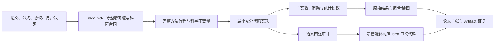

# Faithful Research Code

[English](README.md) | [简体中文](README.zh-CN.md)

面向科研代码生成、论文复现、实验实现、消融研究和 Artifact 发布的 Codex Skill。

它把科研代码视为“可执行的科学主张”：代码不仅需要运行，还必须能够从论文、公式、协议或用户决定追踪到实现、实验命令、原始结果和最终结论，并禁止未经授权的静默语义回退。

## 为什么实现这个 Skill

Codex 是通用代码智能体，其默认行为更像一名软件工程师，而不是科研人员。面对缺失输入、运行异常或环境差异时，它往往优先保证程序可用并继续运行，例如加入默认值、兼容分支、自动重试、备用后端、数据过滤或优雅降级。

这种工程思维适合生产系统，却不一定适合科研代码。科研代码的首要目标不是“尽量运行成功”，而是**忠实执行被声明的方法**。一个看似合理的回退可能改变研究对象、数据分布、算法路径、训练状态、评估协议或统计分母，使最终结果不再代表论文或研究者提出的方法；更严重的是，程序仍可能正常结束，让这种偏差难以被发现。

因此，我们实现 `faithful-research-code`，让 Codex 在科研任务中从“工程可用性优先”切换为“方法忠实性和证据可追踪性优先”：未知项必须暴露，语义变化必须获得授权，完整技术流程必须能够检查，代码只实现研究所需的最小功能。它不会移除认证、权限、路径、资源限制和破坏性操作确认等真实安全机制，而是防止工程便利机制在未经授权时改变科研语义。

## 背景

通用代码生成工具通常从生产工程角度追求可用性、兼容性和持续运行，因此可能自动加入：

- 缺失依赖时切换备用实现；
- 解析失败后跳过样本；
- OOM 后自动减小 batch size 或切换精度；
- 对异常值执行裁剪、补值或过滤；
- checkpoint 不匹配时宽松加载；
- 失败试验不进入统计分母；
- 官方评估器不可用时改用代理指标。

这些机制在工程系统中可能合理，但在科研代码中可能改变数据分布、算法路径、训练状态、评估协议或论文结论。

## 目标

`faithful-research-code` 要求 Codex：

1. 按来源定义的方法生成最小且直接的科研代码；
2. 显式暴露论文、补充材料、参考实现和用户要求之间的冲突；
3. 默认不允许改变科研语义；
4. 展示完整技术流程、模块原理、输入输出和制品传递；
5. 区分主实验、消融实验、方法改编和精确复现；
6. 将论文主张追踪到命令、配置、原始结果、聚合和图表；
7. 保留认证、权限、资源限制和破坏性操作确认等真实安全边界。

## 适用任务

- `EXACT_REPRODUCTION`：按指定来源复现论文结果；
- `SPEC_IMPLEMENTATION`：实现给定公式、算法或实验协议；
- `ADAPTATION`：在保留指定组成部分的同时进行明确授权的修改；
- `ABLATION`：只改变一个声明的科学因素；
- `AUDIT`：审查现有代码是否偏离科研方法。

普通 Web 开发、生产服务重构、认证安全和纯文档编辑不应触发本 Skill。

## 核心工作流

现有 HTML 同时提供流程与 Token 监控：当前阶段、并发分支、服务端报告用量、本地估算和请求明细。用量需要在科研程序的真实调用处显式接入；未接入或缺失时显示未知，不推算 Codex 对话用量。参见 [用量接入规范](faithful-research-code/references/usage-dashboard.md)。

实现代码前，先生成或更新项目根目录的 `idea.md`，拆解研究问题、具体数据集与划分、算法子步骤、主实验/基线/消融及验收条件。遇到会影响实现的歧义，主动询问开发者并暂停相关工作；不擅自选择默认值或缩减范围。每个需求编号关联流程节点、代码和检查。科研路线变更需要保留授权依据及旧实验的文档版本。参见 [idea 模板](faithful-research-code/assets/research-idea-template.md)和[澄清与独立审阅规范](faithful-research-code/references/idea-and-review.md)。

下图只是总览。实际项目的节点必须写明真实数据和算法步骤；本地实时查看器显示需求编号和可展开的详细说明，用分支与汇合展示并发。颜色表示执行状态，不证明科研语义正确。交付前需新建独立智能体，读取需求文档、原始来源/开发者决定和实际代码，检查偏移、遗漏与多余功能；修复后再复查。若环境不支持独立智能体，必须明确说明尚未完成独立审阅。



### 1. 科研合同

每个关键选择被分类为：

- `METHOD_DEFINED`：由方法或来源明确规定；
- `PROTOCOL_DEFINED`：由数据集、benchmark 或评估器规定；
- `USER_DEFINED`：由用户明确授权；
- `UNKNOWN`：现有证据无法确定。

`UNKNOWN` 必须主动提问，并阻塞依赖它的实现；参数化或排除需要开发者明确决定。

### 2. 完整代码流程

Skill 要求报告每个阶段或 round 的：

- 调用方式和执行条件；
- 输入及其来源；
- 技术原理与来源规则；
- 代码位置；
- 输出制品；
- 下游使用方式；
- 失败行为；
- 实际验证方法。

对于 Prompt、检索、正负样本、记忆、训练记录、奖励和评估器，还需展示选择规则、插入位置、解析方式和因果用途。

### 3. 论文主张到结果的追踪

每个主要结论、结果表格和结果图需要映射到：

```text
论文主张
  -> 精确命令
  -> 冻结配置
  -> 数据/模型/评估器版本与哈希
  -> seeds 与运行记录
  -> 原始输出
  -> 聚合或绘图代码
  -> 期望结果与容差
  -> 实际执行状态
```

报告值不得手工复制到表格或图片中。

### 4. 调参、统计与基线公平性

对于结果型实验，Skill 要求预先声明：

- 超参数搜索空间、方法和预算；
- 验证集和测试集访问边界；
- checkpoint、阈值和最优配置选择规则；
- 实验单位、seed、运行次数和估计量；
- 不确定性、失败运行和统计分母；
- 基线的数据、调参预算、算力、选择规则和评估器差异。

### 5. Reviewer-ready Artifact

当任务面向论文发布、公开仓库或 Artifact Evaluation 时，Skill 还会要求：

- 冻结代码版本与环境；
- 区分 smoke test 和完整复现；
- 每项主张对应可执行命令；
- 数据、模型、许可证和访问限制；
- 时间、GPU/CPU、内存、存储、网络和外部服务成本；
- 匿名审稿版与正式归档版的发布状态；
- 已知限制和适用的伦理、隐私或 AI 使用披露。

这些发布要求不会强制施加到单个公式或局部确定性实现上。

## 安装

### 使用 Codex Skill Installer

```bash
python3 ~/.codex/skills/.system/skill-installer/scripts/install-skill-from-github.py \
  --repo Fangzhou-Code/faithful-research-code \
  --path faithful-research-code
```

如果本地已经存在同名 Skill，安装器会停止。请先备份或移动旧版本，再执行安装。

### 手动安装

```bash
git clone https://github.com/Fangzhou-Code/faithful-research-code.git
cp -R faithful-research-code/faithful-research-code ~/.codex/skills/
```

安装后，在下一次 Codex 对话中使用：

```text
$faithful-research-code 请按照论文公式和补充材料实现主实验，并禁止未经授权的语义回退。
```

## 使用示例

### 论文复现

```text
Use $faithful-research-code to reproduce the paper's main experiment, map every reported result to its command and raw artifacts, and expose unresolved source conflicts.
```

### 消融实验

```text
Use $faithful-research-code to remove only the auxiliary loss, keep every other scientific factor fixed, and document main and ablation experiments separately.
```

### 代码审计

```text
Use $faithful-research-code to audit this training pipeline for sample dropping, clipping, checkpoint fallback, backend switching, and denominator changes. Do not edit unless requested.
```

## README 输出要求

实现类任务会生成或更新项目自己的 `README.md`，包括：

- 背景；
- Gap / 挑战；
- 科研方法贡献；
- 支持范围与限制；
- 主实验；
- 消融实验；
- 参数作用和科学影响；
- 完整代码流程和技术原理；
- 论文结果复现映射；
- 调参与统计协议；
- Artifact 发布和验证状态。

生成内容必须来自实际代码和已有来源，不得虚构命令、结果、贡献、许可证或伦理审批。

## Python 语义回退审计器

默认严格 fail-fast：SDK/HTTP 隐式重试必须关闭；失败时停止，不补值、不跳过、不切换能力，并保留失败现场。只有预先定义在科学方法中的步骤可保留，不能用日志、测试或授权注释把运行补救变成方法步骤。并发默认关闭，按协议启用时必须验证顺序、随机流和失败传播。

审计器新增 SDK 默认重试（RF504）、重试配置（RF505）、并发（RF601）、异常结果化（RF602）、分位数方法（RF701）、线程环境顺序（RF702）检查；RF501 重试提示升为高等级。支持直接导入别名，但不做跨模块数据流证明。不存在的路径、空扫描返回错误。

仓库附带一个辅助审计器：

```bash
python faithful-research-code/scripts/audit_semantic_fallbacks.py \
  path/to/changed_code \
  --min-severity low --fail-on medium
```

JSON 审计轨迹：

```bash
python faithful-research-code/scripts/audit_semantic_fallbacks.py \
  path/to/changed_code \
  --json
```

来源明确授权的操作可以使用带理由的抑制标记：

```python
# research-fidelity: allow=RF301 reason="Equation 4 requires clipping before reduction"
value = value.clip(-1, 1)
```

被抑制项仍保留在 JSON 记录中。该工具是 Python AST 启发式审计器，不是科研忠实性的完整证明；YAML、Shell、Slurm、Notebook、聚合和绘图路径仍需人工检查。

## 精简输出与实时流程图

参考 [Ponytail](https://github.com/DietrichGebert/ponytail/blob/main/skills/ponytail/SKILL.md) 的必要性检查和复用原则，内置到本 Skill，不依赖安装或调用另一个插件。科学路线、证据和验证优先于代码行数；代码写入文件，聊天只展示流程、变化、验证结果和链接，不重复完整代码与日志。不承诺未经实测的 token 降幅。

开始生成前分别展示完整的“代码生成”和“实验执行”依赖图。独立节点并列显示，可同时高亮运行；汇合节点等待全部必要依赖。支持未开始、运行中、完成、失败、阻塞、确认取消、条件未执行和状态未知。失败后禁止启动新节点，但保留在途任务的真实结果；停止过的轨道不能提交正式科研结果。代码生成完成不会把实验节点标记为完成。

需要 Python 3.11+。先将 [示例计划](faithful-research-code/assets/progress-plan.example.json) 改成项目实际阶段，再运行：

```bash
python faithful-research-code/scripts/research_progress.py init runs/progress-001 --plan project-plan.json
python faithful-research-code/scripts/research_progress.py serve runs/progress-001
```

打开终端打印的本地地址。生成过程用 `event` 写入真实状态；生成的实验代码用 `stage()` 包裹实际工作。完整接口和限制见 [进度与输出规范](faithful-research-code/references/progress-and-output.md)。原始报错和中间产物仍由科研管线保留，进度日志只记录异常类型。聊天 Mermaid 是快照；进程被强杀后仅有最后已知状态，查看器不虚构进度或成功。

并发工作进程须通过 `collect --endpoint <private-endpoint.json>` 启动的统一记录端提交事件，使用 `event --collector` 或 `stage(..., collector=...)`。记录端串行落盘，不串行执行科研任务，不自动重试、不代替实验调度器取消进程。条件分支须预声明 `condition`，汇合时可接受的未执行依赖须列入 `optional_dependencies`。已知工作总量可用 `total` 和 `update --completed N` 展示真实计数。

审计器需要 Python 3.11+，支持 `--config resolved.json resolved.toml` 检查配置中的重试和并发策略；JSON 报告明确列出尚未验证的动态配置、实际 SDK 行为等范围。YAML 和可执行配置须先由实际启动器导出解析结果，不能靠静态扫描宣称全部验证通过。

## 仓库结构

```text
.
├── README.md
├── README.zh-CN.md
└── faithful-research-code/
    ├── SKILL.md
    ├── agents/openai.yaml
    ├── assets/research-readme-template.md
    ├── assets/progress-plan.example.json
    ├── references/code-generation-contract.md
    ├── references/progress-and-output.md
    ├── scripts/audit_semantic_fallbacks.py
    ├── scripts/research_progress.py
    └── tests/
```

README 位于 GitHub 仓库根目录，不属于实际安装的 Skill 包。

## 验证

最小运行验证方案见 [运行验证规范](faithful-research-code/references/runtime-verification.md)：静态检查不能覆盖的行为必须有对应运行检查；未执行的检查阻止相应验证声明，不会被“无告警”替代。

- `scripts/run_research_workflow.py` 执行明确的本地命令依赖图，监督直接子进程，处理失败、超时、取消与心跳，保存日志和校验清单。它是可选工具；已有合适调度器的项目无需重复引入。
- `scripts/evaluate_behavior.py` 对不同来源的候选模块运行同一套科研行为检查，保留 PASS/FAIL/TIMEOUT、代码哈希和日志。PASS 必须同时满足退出码为零、全部八项检查的完成凭据，以及正确的正式报告；提前退出或跳过检查不能通过。固定提示及参考候选位于 `assets/behavior-eval/`；参考候选只用于验证评测工具，不是新的跨模型证据。

可执行的本地示例（只验证命令流程，不代表科研复现）：

```bash
python faithful-research-code/scripts/run_research_workflow.py faithful-research-code/assets/execution-plan.example.json runs/local-example
python faithful-research-code/scripts/research_progress.py serve runs/local-example
```

运行器要求显式声明 `direct_children_only`，不适用于嵌套多进程、远程任务或脱离管理的守护进程。失败运行没有 `RUN_COMPLETE.json`，部分产物不得进入正式统计；该凭据本身也不代表科学结论正确。

运行单元测试：

```bash
python3 -m unittest discover \
  -s faithful-research-code/tests \
  -p 'test_*.py'
```

当前测试覆盖合同路由、触发样例文件的完整性、审计退出码、别名与重试/并发规则、抑制轨迹、进度状态机、失败现场保留和查看器接口。触发样例测试只校验样例文件，不代表实际模型的触发准确率或科研生成能力已完成评测。

## 局限

- 审计器覆盖 Python AST 与显式传入的 JSON/TOML 配置，仍不能证明动态跨模块行为或真实请求次数；
- Skill 无法替代论文作者对未知协议的确认；
- 测试通过不等同于论文数值复现；
- 作者自行运行不能声明为独立第三方复现；
- 不同会议的匿名、伦理和 Artifact 政策仍应以目标会议当期规则为准。

## 许可证

当前发布目录尚未包含许可证文件。在选择开源许可证前，默认著作权规则仍然适用。
